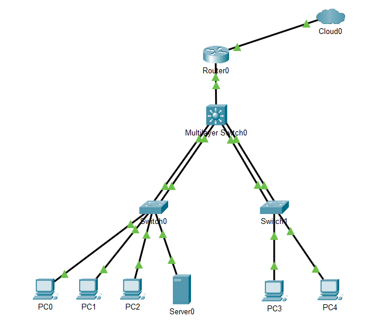

# Enterprise Campus Network Design

**Multi‑VLAN campus with OSPF, DHCP, NAT, ACLs, and EtherChannel redundancy – Cisco Packet Tracer**

## Overview
Designed a production‑ready head office campus network segmented for Users (VLAN 10), Servers (20), Management (30), and Guest (40). Features inter‑VLAN routing via L3 core, OSPF dynamic routing, centralized DHCP/NAT, access controls, and redundant EtherChannel uplinks.

**Technologies Demonstrated:**
- VLAN trunking + EtherChannel (LACP)
- Inter‑VLAN routing (SVIs)
- OSPF Area 0
- DHCP relay + pools
- NAT/PAT overload
- Extended ACLs (mgmt/server protection)

## Quick Start
1. Open
2. Test inter‑VLAN pings, Internet access, ACL denies
3. Run verification commands

## IP Addressing
See [docs/ip-addressing.md](docs/ip-addressing.md)

## Verifications
See [screenshots](screenshots)

## Results
- 100% VLAN isolation + inter‑VLAN connectivity
- OSPF adjacency stable, full route propagation
- NAT translations verified, ACLs blocking unauthorized access
